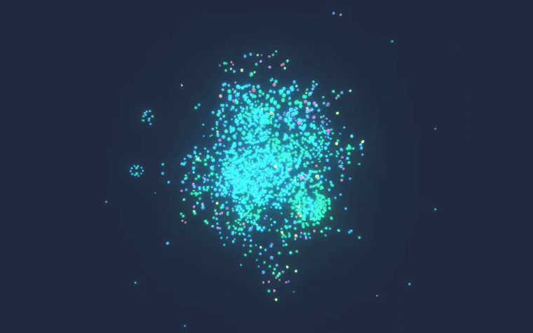

# CortexDB

[](https://pkg.go.dev/github.com/liliang-cn/cortexdb/v2) [](https://github.com/liliang-cn/cortexdb/actions/workflows/ci.yml) [](https://codecov.io/gh/liliang-cn/cortexdb) [](https://opensource.org/licenses/MIT)

A pure-Go, single-file AI memory and knowledge graph. One SQLite file holds vectors, hybrid RAG search, scoped agent memory, an RDF/SPARQL knowledge graph, a Palantir-style ontology, and 60+ agent tools — embedded in your Go program, or installed as a shared brain for Claude Code / Codex. Works with **no embedder** (lexical mode, no API key) or any OpenAI-compatible embeddings endpoint. No service to run.

```bash
go get github.com/liliang-cn/cortexdb/v2
```

[](docs/assets/live-3d-openclaw-cluster.png)



<sub>`serve_graph_3d` on a real shared brain — the one behind an OpenClaw cluster: 2000 entities, 5953 relations, node types the agents wrote themselves. Served from inside the MCP server handling the calls, so the graph lights up as tools touch it. ([Orbit, as MP4](docs/assets/live-3d-orbit.mp4))</sub>

```go
db, _ := cortexdb.Open(cortexdb.DefaultConfig("brain.db"))
defer db.Close()
brain := db.KnowledgeMemory()
_, _ = brain.Remember(ctx, cortexdb.KnowledgeMemoryRememberRequest{Content: "Alice prefers tabs.", Scope: "user"})
rec, _ := brain.Recall(ctx, cortexdb.KnowledgeMemoryRecallRequest{Query: "what does Alice prefer?"})
fmt.Println(rec.ContextPack.Text) // paste-ready context pack with source attribution
```

## What's inside

- **KnowledgeMemory brain facade** — `Recall` / `Remember` / `Reflect` / `Consolidate` / `PromoteToKnowledge` / context packs; fused retrieval across episodic memory, durable knowledge, and GraphRAG chunks; relational answers returned as **graph facts** (`Alice —uses→ Apollo`) read from edges, reliable even with no embedder; deterministic no-LLM `extract_conversation`; memories can carry inline entities/relations so one call stores and graphs them.
- **Composable retrieval** — `cortex_query`: vector / lexical / hybrid / graph prefetch lanes fused by RRF, weighted RRF, or DBSF, with metadata filters and per-source score debugging; an `Authorize` callback gates every candidate (RBAC/ABAC at the retrieval layer); pluggable reranker.
- **Vector + lexical engine** — FTS5, HNSW / IVF / Flat indexes, scalar & binary quantization, geospatial indexing, semantic query routing.
- **External retrieval lanes** — a search cluster you already run (Meilisearch, Weaviate, …) can be one fused lane via `QuerySource`, without becoming the storage: it names candidate ids, the brain still owns the content, and a stale id is dropped rather than fabricated.
- **The knowledge contract** — every record can say *how it knows* and *how sure*: `_source`, `_chunk`, `_producer`, and a `_grade` from a closed set — `verified` (a named person kept it), `self_consistent` (derived from something that stated it), `asserted` (a model or a person said so, unchecked), `held`, `refused` (the vocabulary declined it, with why). `contract_tally` answers what the whole shelf stands on, counting the untagged rows too; `contract_needs_attention` lists what wants a person; `fact_provenance` cites the text a fact came from. Producers call `ValidateContract` before they write. [alchemy](https://github.com/liliang-cn/alchemy) writes the contract for every graph it loads here — the one sink of its six that does.
- **Swappable storage** — SQLite by default; a `postgres://` DSN moves the same brain to **PostgreSQL + pgvector**, with vectors, hybrid search, memory and the RDF graph all running on either. Compile-time backend registry, not a plugin system (storage is the hot path). 104 opt-in PostgreSQL tests, mostly parity: one test body, both databases, same answer required.
- **Knowledge graph** — RDF triples/quads on the same file: a practical SPARQL subset (updates, OPTIONAL/UNION/VALUES, aggregates, subqueries, property paths), RDFS-lite materialized inference, SHACL-lite validation, N-Triples/Turtle/TriG I/O; property-graph `apply_inference` materializes two-hop relation compositions with provenance; entities track asserting documents, and `delete_document_graph` is deletion shaped like ingest.
- **Ontology (Palantir-style)** — typed object/link/interface types with primary keys and cardinality, an object-set algebra (union / intersect / filter / `search_around`), governed **action types** with audit trail, generated typed agent tools, and a breaking-change schema diff; `strict` or `vocabulary` enforcement.
- **Pipelines** — `memoryflow` (transcript → recall → wake-up → promotion), `graphflow` (corpus → graph → HTML report), `importflow` (CSV / SQL dumps / live Postgres-MySQL → RAG + KG), `connector` (PII masking, signed plans, reversible vault, CDC sync).
- **Tools & MCP** — 80+ tools with the same names in-process and over MCP, plus `render_graph_html`, an interactive graph view, and paged bulk listings (`memory_list_all`, `graph_list_all`) — `graph_list_all` defaults to the most-connected core; `order: "id"` walks the whole graph instead, returning `next_cursor` page by page like `memory_list_all` does.
- **Questions about the whole store** — retrieval says what is relevant to a query; these say what is there. A *range* search returns everything within a distance of the query and nothing outside it, which is the honest answer when a top-K would invent a K (`search_vector_range`, and the response says when a cap hid matches). `Aggregate` counts, sums and groups by a metadata field (`aggregate_metadata`). And `VectorAggregate` reduces the vectors themselves — centroid, geometric median, and the **medoid**, the stored record closest to all the others in its group, which answers "which of these near-duplicates is canonical" and "what is this cluster about" arithmetically, with no model in the loop (`representative_records`). All identical on both backends, with one test body per behaviour run against each.
- **The graph describing itself** — `graph_schema` reports the *observed* schema (which node and edge types exist, which type pairs each edge really connects, which property keys each type carries) and `graph_property_values` reports what values a key actually takes, because a filter written from a key's name — `color == "black"` against rows that say `BLK` — returns nothing and reads as a fact. A declared ontology is opt-in and absent on exactly the graphs whose shape nobody knows; this is measured from the rows, and comes with a rendered form meant to be pasted into a prompt. Alongside them `rank_graph_nodes` (what the brain is structurally about), `graph_statistics` (a component count far above 1 means entities were written and never linked) and `predict_graph_edges` (a missing fact, or one entity stored twice).
- **Disambiguation against the graph** — `disambiguate_mentions` resolves an ambiguous name using the names given with it: shortest paths between their candidates, each rendered as a sentence with its edge ids. The deterministic four steps are the library's; the choice is the caller's, so it works with no model at all and can always say why. A mention nothing connects to is unresolved, never the nearest string.
- **A hit that arrives whole** — `chunk_window` returns each hit's neighbouring chunks as context, marked as context, never as matches. For the failure chunking guarantees: a real retrieval returned a hit beginning `ance.` — *importance*, cut at a boundary.
- **Quality, measured** — `pkg/eval` runs a labeled query set through the real retrieval path with recall@k / nDCG regression floors in CI; FTS5 / SPARQL / SQL-dump parsers are fuzz-tested.

## Claude Code / Codex plugin & shared brain

```text
/plugin marketplace add liliang-cn/cortexdb   →   /plugin install cortexdb@cortexdb      (Claude Code)
codex plugin marketplace add liliang-cn/cortexdb && codex plugin add cortexdb@cortexdb   (Codex)
```

Lexical mode by default, one global brain at `~/.cortexdb/cortexdb.db`, slash commands (`/remember`, `/recall`, `/cortexdb-graph`) and an auto-recall hook. Point many agents and machines at one `cortexdb-grpc` (`CORTEXDB_REMOTE=host:port` + token) and Claude Code, Codex, [OpenClaw](https://github.com/liliang-cn/openclaw-cortexdb-memory) and [Hermes](https://github.com/liliang-cn/hermes-cortexdb-memory) share the **same** memory and graph. Typed clients: `cargo add cortexdb-client` · `pip install cortexdb-client` · `npm install cortexdb-client`.

To keep that server up, [`deploy/`](deploy/) has a hardened systemd unit and a container image whose healthcheck is the server binary itself (`cortexdb-grpc -health`). Every port has a default and every default is overridable.

## More

Full guide (layers, ontology details, shared-brain ops): [docs/GUIDE.md](docs/GUIDE.md) · 16 runnable [examples](examples/README.md) (`go run ./examples/01_core` … `16_ontology`) · launch kit: [docs/LAUNCH_KIT.md](docs/LAUNCH_KIT.md) · 中文: [README_CN.md](README_CN.md)

Embedded, inspectable, local-first — not a distributed vector database, not an enterprise RDF server.
