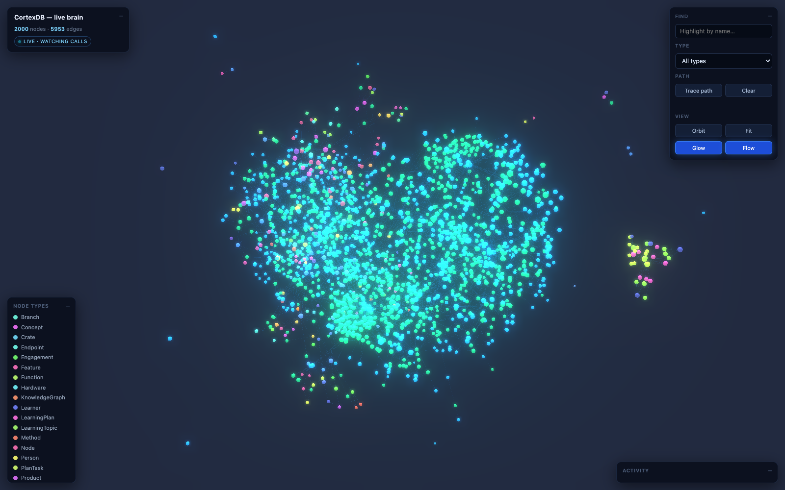

# CortexDB

[](https://pkg.go.dev/github.com/liliang-cn/cortexdb/v2) [](https://github.com/liliang-cn/cortexdb/actions/workflows/ci.yml) [](https://codecov.io/gh/liliang-cn/cortexdb) [](https://opensource.org/licenses/MIT)

纯 Go、单文件的 AI 记忆与知识图谱。一个 SQLite 文件装下:向量、混合 RAG 检索、分作用域的 agent 记忆、RDF/SPARQL 知识图谱、Palantir 风格 ontology、60+ agent 工具——既可嵌进你的 Go 程序,也可作为 Claude Code / Codex 的共享大脑插件。**无 embedder 也能跑**(词法模式,无需 API key),或接任何 OpenAI 兼容 embeddings 端点。零外部服务。

```bash
go get github.com/liliang-cn/cortexdb/v2
```

[](docs/assets/live-3d-openclaw-cluster.png)

<sub>`serve_graph_3d` 跑在一个真实共享大脑上 —— OpenClaw 集群背后的那个：2000 个实体、5953 条关系，节点类型是 agent 自己写进去的。它由处理这些调用的 MCP 服务端内部提供，所以工具每碰一次图谱，图就亮一次。</sub>

```go
db, _ := cortexdb.Open(cortexdb.DefaultConfig("brain.db"))
defer db.Close()
brain := db.KnowledgeMemory()
_, _ = brain.Remember(ctx, cortexdb.KnowledgeMemoryRememberRequest{Content: "Alice 偏好 tab 缩进。", Scope: "user"})
rec, _ := brain.Recall(ctx, cortexdb.KnowledgeMemoryRecallRequest{Query: "Alice 偏好什么?"})
fmt.Println(rec.ContextPack.Text) // 可直接粘贴的上下文包,带来源标注
```

## 里面有什么

- **KnowledgeMemory 大脑门面** — `Recall` / `Remember` / `Reflect` / `Consolidate` / `PromoteToKnowledge` / 上下文包;融合检索横跨情景记忆、持久知识与 GraphRAG 分块;关系型问题以**图边事实**回答(`Alice —uses→ Apollo`),无 embedder 也可靠;确定性(不调 LLM)的 `extract_conversation`;记忆可内联携带实体/关系,存储与入图一次完成。
- **可组合检索** — `cortex_query`:vector / lexical / hybrid / graph 四条预取通道,RRF、加权 RRF 或 DBSF 融合,带元数据过滤与逐源打分调试;`Authorize` 回调在检索层对每个候选做 RBAC/ABAC 门禁;可插拔重排器。
- **向量 + 词法引擎** — FTS5、HNSW / IVF / Flat 索引、标量与二值量化、地理索引、语义查询路由。
- **可换存储后端** — 默认 SQLite；把 DSN 换成 `postgres://` 就把同一个大脑搬到 **PostgreSQL + pgvector**，向量、混合检索、记忆和 RDF 图谱在两个后端上都跑。注册表是编译期的，不是插件系统（存储是热路径）。104 个 opt-in 的 PostgreSQL 测试，大多是 parity 测试：一份测试体、两个数据库、必须给出相同答案。
- **知识图谱** — 同一文件上的 RDF 三元组/四元组:实用 SPARQL 子集(更新、OPTIONAL/UNION/VALUES、聚合、子查询、属性路径)、RDFS-lite 物化推理、SHACL-lite 校验、N-Triples/Turtle/TriG 读写;属性图侧 `apply_inference` 物化两跳关系组合并带出处;实体记录断言文档,`delete_document_graph` 是按摄入形状做的删除。
- **Ontology(Palantir 风格)** — 带主键与基数的对象/链接/接口类型,对象集代数(union / intersect / filter / `search_around`),带审计的受治理**动作类型**,自动生成的类型化 agent 工具,以及破坏性变更的 schema diff;`strict` 与 `vocabulary` 两种执行模式。
- **流水线** — `memoryflow`(转录 → 召回 → 唤醒 → 晋升)、`graphflow`(语料 → 图 → HTML 报告)、`importflow`(CSV / SQL dump / 在线 Postgres-MySQL → RAG + KG)、`connector`(PII 脱敏、签名计划、可逆保险库、CDC 同步)。
- **工具与 MCP** — 60+ 工具,进程内与 MCP 同名同义,另有交互式图谱视图 `render_graph_html`。
- **质量是测出来的** — `pkg/eval` 用标注查询集走真实检索路径,recall@k / nDCG 回归下限进 CI;FTS5 / SPARQL / SQL-dump 解析器有 fuzz 测试。

## Claude Code / Codex 插件与共享大脑

```text
/plugin marketplace add liliang-cn/cortexdb   →   /plugin install cortexdb@cortexdb      (Claude Code)
codex plugin marketplace add liliang-cn/cortexdb && codex plugin add cortexdb@cortexdb   (Codex)
```

默认词法模式,全局大脑在 `~/.cortexdb/cortexdb.db`,带斜杠命令(`/remember`、`/recall`、`/cortexdb-graph`)和自动召回 hook。把多个 agent、多台机器指向同一个 `cortexdb-grpc`(`CORTEXDB_REMOTE=host:port` + token),Claude Code、Codex、[OpenClaw](https://github.com/liliang-cn/openclaw-cortexdb-memory)、[Hermes](https://github.com/liliang-cn/hermes-cortexdb-memory) 就共享**同一份**记忆与图谱。多语言客户端:`cargo add cortexdb-client` · `pip install cortexdb-client` · `npm install cortexdb-client`。

要让这个服务常驻,[`deploy/`](deploy/) 提供了加固过的 systemd unit,以及 healthcheck 就是服务端二进制自己(`cortexdb-grpc -health`)的容器镜像。所有端口都有默认值,也都可以覆盖。

## 更多

完整指南(分层、ontology 细节、共享大脑运维):[docs/GUIDE_CN.md](docs/GUIDE_CN.md) · 16 个可运行[示例](examples/README.md)(`go run ./examples/01_core` … `16_ontology`) · 发布套件:[docs/LAUNCH_KIT.md](docs/LAUNCH_KIT.md) · English: [README.md](README.md)

嵌入式、可审视、local-first——不做分布式向量数据库,也不做企业级 RDF 服务器。
