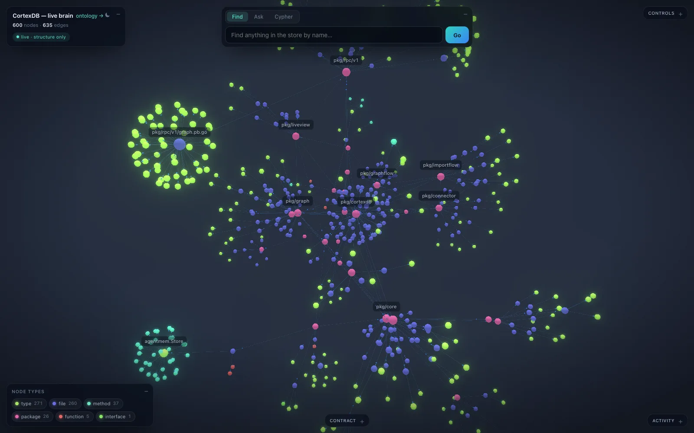

# CortexDB

[](https://pkg.go.dev/github.com/liliang-cn/cortexdb/v2) [](https://github.com/liliang-cn/cortexdb/actions/workflows/ci.yml) [](https://codecov.io/gh/liliang-cn/cortexdb) [](https://opensource.org/licenses/MIT)

一个 SQLite 文件装下 AI 记忆与知识图谱。纯 Go，不用额外跑服务，没有 embedding 模型也能用。



## 安装

| | |
| --- | --- |
| Go 库 | `go get github.com/liliang-cn/cortexdb/v2` |
| Claude Code | `/plugin marketplace add liliang-cn/cortexdb`，再 `/plugin install cortexdb@cortexdb` |
| Codex | `codex plugin marketplace add liliang-cn/cortexdb && codex plugin add cortexdb@cortexdb` |
| Claude Code mod（可选） | `/plugin install cortexdb-live@cortexdb` |
| 共享大脑服务端 | `go install github.com/liliang-cn/cortexdb/v2/cmd/cortexdb-grpc@latest` |
| 客户端 | `cargo add cortexdb-client` · `pip install cortexdb-client` · `npm install cortexdb-client` |

## 使用

```go
db, _ := cortexdb.Open(cortexdb.DefaultConfig("brain.db"))
defer db.Close()
brain := db.KnowledgeMemory()
_, _ = brain.Remember(ctx, cortexdb.KnowledgeMemoryRememberRequest{Content: "Alice 偏好 tab 缩进。", Scope: "user"})
rec, _ := brain.Recall(ctx, cortexdb.KnowledgeMemoryRecallRequest{Query: "Alice 偏好什么?"})
fmt.Println(rec.ContextPack.Text)
```

插件给 Claude Code 和 Codex 一个全局大脑 `~/.cortexdb/cortexdb.db`，带 `/remember`、`/recall` 和自动召回 hook。多个 agent、多台机器指向同一个 `cortexdb-grpc`，就共享同一份记忆和图谱。

Codex 中需要在 `/hooks` 审阅并信任插件 hooks，自动召回才会运行。
配置和 `cortexdb-mcp --doctor --self-test` 诊断用法见[插件指南](plugins/cortexdb/README.md)；诊断命令需要 v2.119.0 或更新版本的二进制。

## Claude Code mod

`cortexdb-live` 是一个可选的 [mod](https://code.claude.com/docs/en/plugins/mods/overview)，运行在 Claude Code 里，叠在 `cortexdb` 插件之上。装好插件后再装：

```
/plugin install cortexdb-live@cortexdb
```

- **规划过的召回**：检索之前，haiku 先把每条 prompt 拆成中英文关键词、别名、实体名和检索方式。只是「好」「发」这类确认就不检索。输入框上方显示召回了什么，展开能看到查询规划和每一条结果。隐藏后，下一次召回会自动重新出现；想马上找回刚隐藏的那条，用 `/cortexdb-show`。
- **状态栏**：当前连的是哪个大脑、节点数、上次召回用时；连不上时显示原因。
- **自动记忆**：会话空闲 90 秒后，haiku 把新增的对话提炼成长期记忆（`auto:<会话>:<slug>`）。之后再提炼时，同一个 slug 是替换而不是重复写一条。

haiku 用的是 Claude Code 自己的模型额度，不需要 API key。语言：`/config` → `cortexdb-live` → `language`（`auto`、`zh`、`en`）。mod 认插件原有的开关：`cortexdb-recall --disable`、`cortexdb-session-end --disable` 会同时关掉两边的召回和记忆。mod 运行时，插件的 shell 召回和记忆钩子会自动让开，不会重复做。Codex 仍然用那两个钩子。mod 是 Claude Code 的早期功能（按 2.1.290 构建）。

## 里面有什么

- 向量（HNSW、IVF、Flat、二值编码）、FTS5 全文检索、混合检索与图检索
- RAG 知识、分作用域的 agent 记忆、带来源的上下文包
- RDF 1.2 知识图谱：SPARQL 1.1/1.2、RDFS + OWL 2 RL 推理、SHACL Core + SHACL-SPARQL、RDF/XML 导入（通过 W3C 官方测试），以及只读 Cypher
- Palantir 风格的 ontology，带受治理的动作
- 80+ 工具，进程内调用或走 MCP
- `serve_graph_3d`：实时 3D 视图，可查找、提问、查询、展开，桌面和手机都能用
- 变更事件流：每次已提交的写入，按顺序、恰好一次
- 默认 SQLite，换成 `postgres://` DSN 就跑在 PostgreSQL + pgvector 上

## 环境变量

| 变量 | 含义 |
| --- | --- |
| `CORTEXDB_PATH` | 数据库文件（默认 `~/.cortexdb/cortexdb.db`） |
| `CORTEXDB_REMOTE` | 连到 `host:port` 上的共享 `cortexdb-grpc`，不用本地文件 |
| `CORTEXDB_GRPC_TOKEN` | 该服务的 Bearer token |
| `CORTEXDB_GRPC_ADDR` | 服务端监听地址（默认 `127.0.0.1:47821`） |
| `CORTEXDB_EMBED_BASE_URL` | OpenAI 兼容的 embeddings 端点；不设就是词法模式 |
| `CORTEXDB_EMBED_MODEL` / `CORTEXDB_EMBED_DIM` | embedding 模型和维度 |

## 文档

[官网](https://liliang-cn.github.io/cortexdb/zh/) · [指南](docs/GUIDE_CN.md)（完整功能一览） · [示例](examples/README.md) · [更新日志](CHANGELOG.md) · [English](README.md)

## License

MIT
